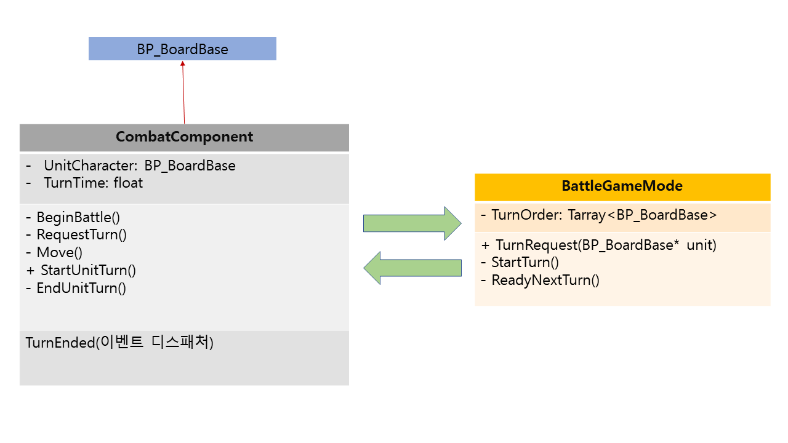

# Unreal Portfolio
 - 엔진 : Unreal Engine 4 (4.25.4 버전)
 - 에디터 : Microsoft Visual Studio Community 2019 (16.7.3 버전)
 - 제작기간 : 2022.01.02 ~ 개발중
 - 개발규모 : 1인개발

# 기술 설명서

> 턴 바꾸는 기능 구현

## BP_BoardBase

* CombatComponent를 가지고 있다.

## CombatComponent

* BeginBattle(): TurnTime 이후 RequestTurn()을 호출하는 함수
* RequestTurn(): 자신을 가지고 있는 BP_BoardBase를 GameMode의 TurnRequest에 전달하는 함수
* StartUnitTurn(): 턴을 받았다는 의미
* EndUnitTurn(): 턴이 끝났다는 의미, TurnEnded 이벤트 디스패처를 호출한다.

##  BattleGameMode

* TurnRequest(): 턴을 받고 StartTurn을 호출하는 함수
* StartTurn(): 턴인 Unit의 CombatComponent에 있는 StartUnitTurn()을 호출하고, ReadyNextTurn()을 TurnEnded의 이벤트 목록에 바인딩한다.
* ReadyNextTurn(): 다음 턴을 넘겨줄 수 있는지 없는지 판단하고, 없으면 다음 레벨로 이동 명령을 한다.

- RequestTurn 함수가 GameMode의 TurnRequest를 호출한다.

- TurnOrder에 Unit을 넣고, StartTurn을 호출한다.

- TurnOrder의 0번째 Unit이 유효하다면 CombatComponent의 StartUnitTurn을 호출한다.

* StartUnitTurn이 진행된 후 EndUnitTurn을 호출해서 TurnEnded 이벤트 디스패처를 호출한다.

* TurnEnded의 이벤트 목록에 있는 ReadyNextTurn이 호출되고, TurnEnded를 호출한 Unit을 TurnOrder 목록에서 제거한다.

* TurnOrder의 0번째 Unit이 유효하면 StartTurn을 호출하고, 유효하지 않으면 전원 턴 종료로 판단한다.

# 참고 자료

* ## 보드 게임
  1. 보드 게임 구현 방법 1 - [Unity 2D Tutorial How To Create Simple Board Game With Dice Rolling And Turn Based Movement Features](https://youtu.be/W8ielU8iURI)
  2. 보드 게임 구현 방법2 - [Unity 3D: Board game(tutorial)](https://youtube.com/playlist?list=PLDcwWgfSSwTgIgtBkSn3lSFjzJQOxbr5E)
  3. 보드 게임 구현 방법3 - [Simple Board Game with Entities! Unity Game Dev Log [Part 1]](https://youtu.be/lW4cpcFHMRM)
  4. 보드 칸 이동하는 기능 구현 방법 - [언리얼 횡스크롤 게임 만들기 14 몬스터 AI 1](https://youtu.be/iJmPx_jqAN8)
  5. 보드 게임 턴 바꾸는 기능 구현 방법 - [UE4 턴제 게임 튜토리얼](https://youtube.com/playlist?list=PLjs_xf1mPQQN-uFdvbjNT06LIDAIvZGaj)

* ## 액션 게임
  1. 액션 게임의 전체적인 구현 방법 - 이득우의 언리얼 C++ 게임 개발의 정석
  2. 액션 게임 구현 방법 - 왕초보 따라하며 스마트폰 게임 내가 만들어 한다: 언리얼 엔진
  3. 액션 게임 구현 방법 - 만들면서 배우는 언리얼 게임 프로그래밍
  4. AI 구현 방법1 - [게임을 만들어 보자 언리얼 엔진 블루프린트 2편 (11장)](https://youtu.be/CfBTSi8AQCg?t=958)
  5. 타이머 구현 방법1 - [Countdown Timer - Unreal Engine 4 Tutorial](https://youtu.be/nHK97x6ILYo)
  6. 타이머 구현 방법2 - [Round Timer + Match Flow (Pt. 1)!,  How To Make YOUR OWN Fighting Game!,  UE4/C++ Tutorial, Part 50](https://youtu.be/-zDJJjN_urA)

* ## 보드, 액션 게임 통합
  1. 저장 기능 구현 방법 - [Save & Load Game (Statistics, Location & More) - Unreal Engine 4 Tutorial](https://youtu.be/coPqS4eTphM)
  2. 레벨 이동 기능 구현 방법 - [How To Create A Main Menu - Unreal Engine 4 Tutorial](https://youtu.be/K1vVbwMJCTQ})

* ## UMG
  1. UI 설계 방법 - [[NDC] 언리얼 4 UMG - 초보자도 쉽게 배우는 게임 UI 개발](https://youtu.be/G-ZzeNsOcVA)
